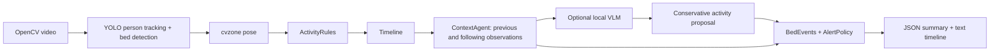

# Elderly Care Agent

A small Python OOP application that follows an OpenCV loop: read a frame, detect
objects with YOLO, estimate pose with cvzone, and record activity over time. It produces
a timeline, durations, bed exits/returns, and NORMAL / MONITOR / ALERT decisions.
Optional local Ollama review examines uncertain observations in context.

This is an assignment prototype. Its measured errors and limits are in
[evaluation results](docs/EVALUATION.md); a working pipeline is not a clinical accuracy claim.

## Install

Use Python 3.12 and [uv](https://docs.astral.sh/uv/). From the repository root:

```powershell
uv sync --frozen
uv run elderly-care-agent prepare-dataset
```

The lockfile pins compatible cvzone, MediaPipe, OpenCV, and Ultralytics versions.
Use this project's environment, not a globally modified cvzone package. YOLO downloads
`yolo26s.pt` on first use into `data/cache/vision/`. Downloads require internet access.
The GMDCSA24 archive is about 1.1 GB. Existing staged videos are reused.

To use an already extracted official dataset:

```powershell
uv run elderly-care-agent prepare-dataset --source "D:\datasets\GMDCSA24"
```

## Run a video

```powershell
uv run elderly-care-agent analyze "data/raw/gmdcsa24/development/Subject 1/05.mp4" --show
```

Supply only the video. Bed detection, the contact region and target-person selection
are automatic. There is no rectangle selection or person-ID input. Press `q` to stop
early; the report records `completed: false`.

For a repeatable run without a window:

```powershell
uv run elderly-care-agent analyze "data/raw/gmdcsa24/development/Subject 1/05.mp4"
```

YOLO checks for one unambiguous bed once per second and stabilizes its box using the
median of five detections. Failed detections are retried. The upper half of the bed
box estimates the mattress contact region. This is an automatic geometric estimate,
not trained mattress segmentation; perspective and hanging covers can cause errors.
The scene assumes a fixed camera. Multiple ambiguous beds remain UNKNOWN without a prompt.
The report records the detected box, estimated region and automatically selected person ID.

The CLI prints `summary` and `events` first, followed by `additional_outputs` file paths.
The output directory contains:

- `report.json`: only the eight summary fields from the assignment example.
- `events.json`: events with `event`, `start_time`, `confirm_time`, `previous_state`,
  `current_state`, `confidence`, and `decision`, matching the assignment example.
- `additional.json`: timeline, observations, pose features, scene setup, settings,
  overall decision, unknown bed duration, and events with precise numeric seconds.
- `timeline.txt`: readable activity intervals.

Event timestamps use elapsed `HH:MM:SS`, with fractional seconds omitted for display.
Full precision is retained in `additional.json`. An empty `events.json` means no event
was confirmed. UNKNOWN bed time remains separate from known out-of-bed duration.
The window shows candidate frame states. Saved intervals are finalized after the video
using temporal confirmation and neighboring context.
The tracker runs on every decoded frame; pose/activity are sampled at 5 frames/second. Use
`--sample-fps 30` to analyze every frame of these approximately 30 FPS clips.
Time is frame index / source FPS, never inference time. Convert variable-frame-rate
input to constant frame rate before analysis.

## Architecture



| File / class | Responsibility |
|---|---|
| `vision.py` / `Vision` | YOLO boxes, selected person ID, cvzone pose, preview |
| `activity.py` / `ActivityRules` | Body angles, motion, mattress relationship |
| `timeline.py` / `Timeline` | Stable contiguous intervals |
| `agent.py` / `ContextAgent` | Decide when previous/following context or VLM is needed |
| `events.py` / `BedEvents`, `AlertPolicy` | Meaningful transitions and decisions |
| `pipeline.py` / `CareMonitor` | One video loop, summaries, output files |
| `report.py` / `Report` | Assignment-format summary and events, separate diagnostics |
| `evaluation.py` / `Evaluator` | Compare predictions with timestamped labels |
| `models.py`, `dataset.py`, `cli.py` | Data objects, dataset preparation, commands |

Read `CareMonitor.run()` first, then `ActivityRules.classify()`. The active code has
no repository interfaces, factories, adapter layers, or dependency-injection framework.
Previous code and tests remain recoverable from Git tag `archive/before-clean-assignment`.

## States and events

Activities: `lying_in_bed`, `sitting_on_bed`, `sitting_outside_bed`, `standing`,
`walking`, `unknown`. `out_of_bed` is a separate bed state so walking and being
out of bed coexist without double-counting duration.

Torso/leg geometry estimates posture. Recent hip displacement supports walking.
Mattress distance includes a small body-scaled tolerance. Short candidate runs become
UNKNOWN. A short gap is filled only when both neighbors agree and person identity is
available. Boundaries are offline estimates using following context, not live alert times.

The first sole person track is selected and retained. When multiple people are present,
the system selects a person only when their bed overlap clearly exceeds everyone else's.
Otherwise it waits for an unambiguous scene. This heuristic does not establish identity;
a caregiver can overlap the bed too. Missing or changed IDs remain UNKNOWN. Track IDs
can still switch during difficult occlusions; appearance-based identity is not implemented.

- **BED_EXIT:** previously in bed, then sustained walking outside and moving away
  from the mattress. Sitting up or briefly standing and sitting again is not an exit.
- **BED_RETURN:** previously outside, then in-bed posture and confirmed lying.
  Sitting starts occupancy; lying completes the return.
- Long unknown gaps reset event evidence. VLM-only segments cannot establish
  exits, returns, or prolonged-absence alerts.

Confidence values are heuristic scores, not calibrated probabilities.

## Context and decisions

`ContextAgent` checks previous and following segments for each UNKNOWN interval and
records its actions. With a VLM, up to three unresolved intervals also receive earlier,
middle, and following images. A confident proposal can fill at most two seconds,
only when bed relation agrees with both neighbors and target identity is available.
Otherwise it abstains.

```powershell
ollama pull qwen3-vl:4b-instruct
uv run elderly-care-agent analyze "data/raw/gmdcsa24/development/Subject 1/05.mp4" --with-vlm --max-reviews 1
```

Ollama must run at `http://localhost:11434`. Failed, invalid, or timed-out responses
are recorded and leave the interval UNKNOWN. CPU inference may take minutes.

| Decision | Default condition |
|---|---|
| NORMAL | No configured monitoring or alert condition occurred |
| MONITOR | Confirmed exit; UNKNOWN for 3 s; or sitting on bed for 120 s |
| ALERT | Confirmed exit followed by 60 s of continuous, visible out-of-bed time |

Settings are in `models.Settings`. The sitting monitor includes all prolonged bed
sitting because edge position is uncertain. A disappeared person is UNKNOWN, not
proof of exit. Unknown intervals interrupt the absence timer. The summary retains
the most severe observed decision.

## Evaluate and test

```powershell
uv run elderly-care-agent evaluate --output outputs/evaluation
uv run python -m unittest discover -s tests -v
uv run ruff check src tests
uv run ruff format --check src tests
```

The five annotated cases in `config/evaluation.yml` produce duration-weighted accuracy,
confusion in seconds, per-state duration errors, and one-to-one event precision/recall
with a one-second start-time tolerance. UNKNOWN counts as an error against known labels.
Precision is `null` when there are no predictions. Annotation timestamps are approximate.

See [submission artifacts](submission/), [requirements](docs/ASSIGNMENT_CHECKLIST.md),
[validation checks](docs/VALIDATION.md),
[interview explanation](docs/EXPLANATION.md), and [data attribution](docs/DATASET_CARD.md).
Videos, weights, caches, and diagnostic frames stay out of Git. Submission reports
contain numerical predictions, not identifiable video images.
