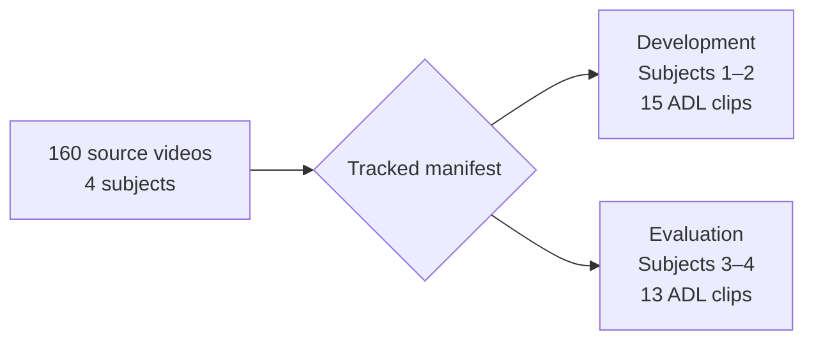

# GMDCSA-24 dataset card

## Ownership and citation

```text
Original creator / data owner: Ekram Alam
Official dataset:             Zenodo v2.0
Dataset DOI:                  10.5281/zenodo.12921216
Canonical repository:         ekramalam/GMDCSA24-...
Project mirror:               SasanDilanthaSTD/GMDCSA24-...
Pinned mirror commit:         5abac7693229900cf80f722e878fbb119211fc1c
```

The project mirror is a reproducibility mirror. It does **not** replace the
original creator, DOI, or canonical repository in attribution.

### Required citations

- Dataset: Ekram Alam (2024), *GMDCSA24-A-Dataset-for-Human-Fall-Detection-in-Videos:
  2.0*, Zenodo, <https://doi.org/10.5281/zenodo.12921216>.
- Data article: Ekram Alam, Abu Sufian, Paramartha Dutta, Marco Leo, and
  Ibrahim A. Hameed (2024), *GMDCSA-24: A dataset for human fall detection in
  videos*, Data in Brief 57, 110892,
  <https://doi.org/10.1016/j.dib.2024.110892>.

Machine-readable citation: [`data/CITATION.cff`](../data/CITATION.cff).

## License boundary

| Material | License recorded by source | What this project does |
|---|---|---|
| Zenodo v2.0 dataset record/archive | CC BY 4.0 | Keeps attribution, DOI, version, checksum |
| GitHub repository files | MIT, copyright Ekram Alam | Copies the included `LICENSE` with staged data |
| Elderly Care Agent source code | Project `LICENSE` | Kept separate from third-party data |

When redistributing any data, retain the source attribution and license files.

## Contents and project selection



Only 28 ADL clips relevant to the assignment states are staged. Fall clips are
not used in this first activity/bed-monitoring implementation. Subjects never
cross the development/evaluation boundary.

## Known limitations

- Only four performers; not representative of all older adults, homes, clothing,
  mobility aids, lighting, camera positions, or health conditions.
- Actions are staged, so results cannot be treated as clinical performance.
- The selected subset emphasizes the assignment's bed/activity states and is not
  a general fall-detection benchmark.
- Video contains identifiable people. Keep raw data local and do not publish it
  in this source repository.
- Human review remains required for safety-critical alerts.
