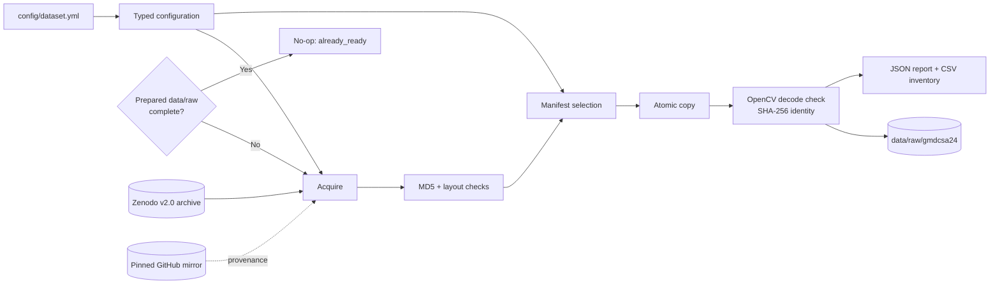

# Dataset pipeline

## Architecture



The availability check runs first. Download, extraction, and copying execute
only when the manifest-selected dataset is missing or incomplete in
`data/raw/gmdcsa24`. A complete raw dataset does not depend on the cache and
returns `already_ready` immediately.

Downloads are written to a uniquely named `.part` file. The downloader checks
the HTTP byte count, retries stalled/incomplete transfers up to three times,
and publishes the configured ZIP name only after the complete response arrives.
A cached ZIP with the wrong MD5 is removed and downloaded again automatically.

## Code map

```text
config/dataset.yml
        │
        ▼
configuration/dataset_configuration.py  YAML → immutable config
        │
        ▼
components/data_ingestion.py             acquire → select → stage → report
        │
        ├── infrastructure/dataset_io.py  HTTP, checksum, safe ZIP, OpenCV
        └── csv_dataset_selection...py    manifest validation + split isolation
        │
        ▼
pipeline/dataset_pipeline.py             production composition root
```

This adapts the config/entity/component/stage structure from the owner's two
reference ML repositories, while omitting GCP, training, model registry, web UI,
and deployment code that is unrelated to this assignment.

## Run

```powershell
uv sync --frozen
uv run elderly-care-agent prepare-dataset
```

## Logging and progress

```text
terminal (stderr)                     logs/elderly-care-agent.log
        │                                        │
        └── timestamp | level | component | event┘

stdout remains clean JSON for scripts and automation.
```

Default `INFO` logs show:

```text
configuration → availability decision → download percentage/retry
→ checksum → extraction progress → source validation
→ selection/staging progress → inventory/report → completion
```

Commands:

```powershell
# Normal progress plus rotating file log
uv run elderly-care-agent prepare-dataset

# Include individual video/file operations
uv run elderly-care-agent --log-level DEBUG prepare-dataset

# Terminal logs only
uv run elderly-care-agent --console-only prepare-dataset
```

The file log rotates at 5 MiB and keeps three backups. `logs/` is ignored by
Git. Environment overrides are `ELDERLY_CARE_LOG_LEVEL` and
`ELDERLY_CARE_LOG_FILE`.

Optional portable cache location:

```powershell
$env:GMDCSA24_CACHE_DIR = "E:\Datasets\gmdcsa24-cache"
uv run elderly-care-agent prepare-dataset
```

Use `--force` only to replace a staged generated file whose SHA-256 differs from
its verified source. The source archive/directory is never silently overwritten.

## Testable contract

```text
PASS
├── official archive checksum matches
├── source has 160 MP4 + 8 CSV + Subjects 1–4
├── manifest contains safe, unique paths
├── subjects do not leak across splits
├── all 28 staged SHA-256 values match source
├── OpenCV decodes the first frame of every staged video
└── report + inventory are written atomically
```

Generated artifacts (ignored by Git):

```text
artifacts/data_pipeline/preparation_report.json
artifacts/data_pipeline/selected_files.csv
```
